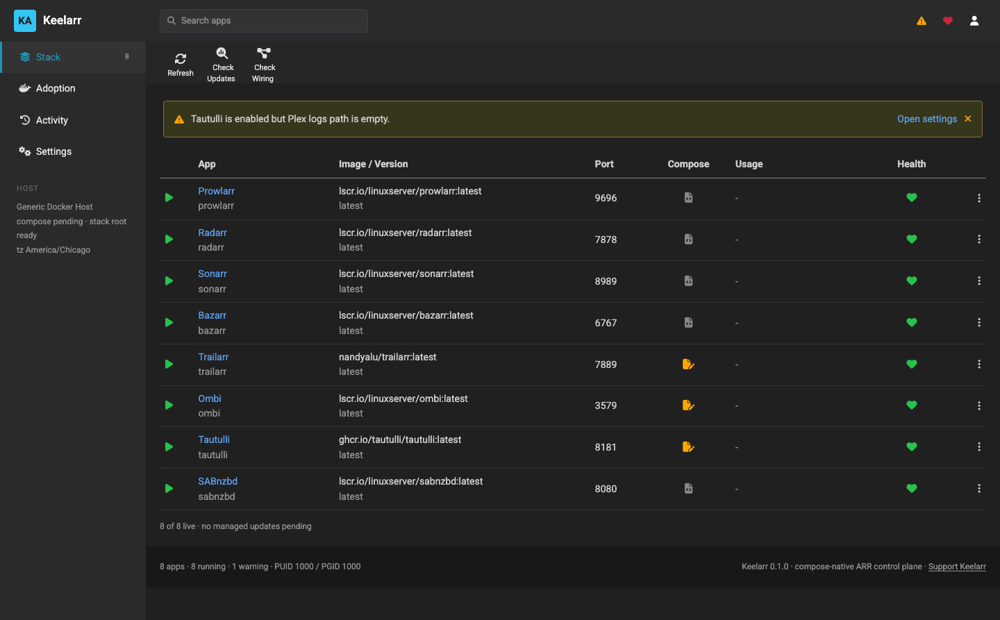
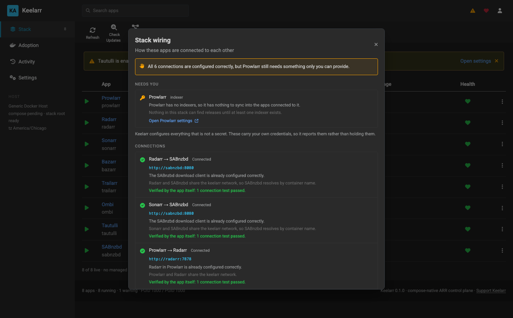
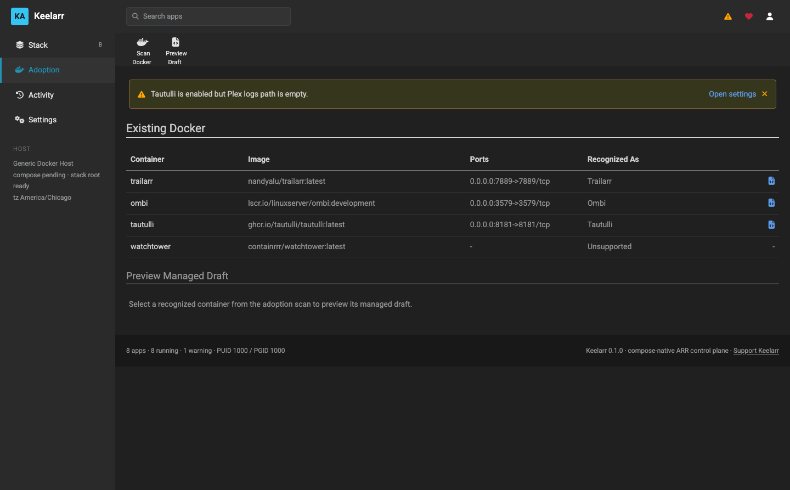
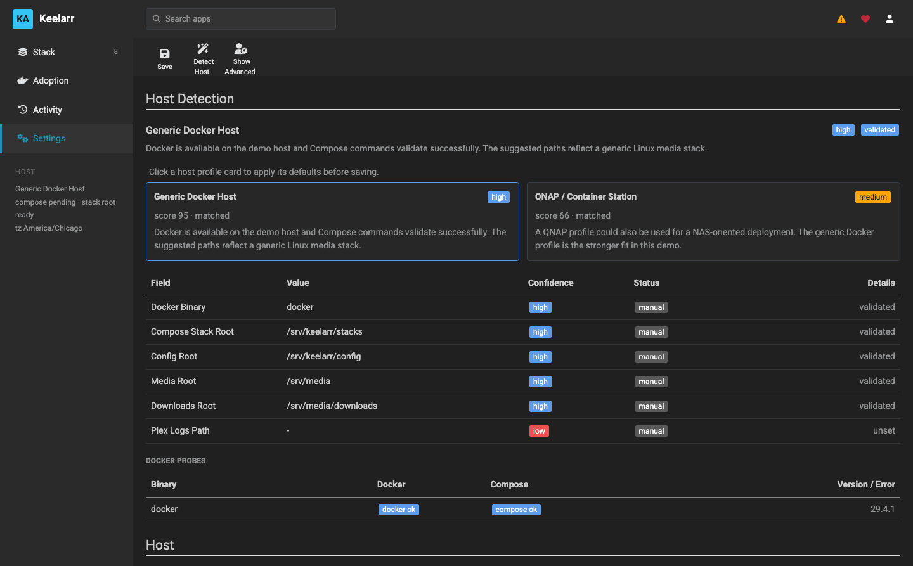

<div align="center">

# Keelarr

**Set up and run a self-hosted \*arr media stack with Docker Compose.**

Keelarr installs Radarr, Sonarr, Prowlarr, Bazarr, SABnzbd, qBittorrent, Jellyfin
and the rest, connects them to each other, and writes Compose files you own —
without ever claiming it did something it didn't.

[Quick start](#quick-start) · [Wiki](https://github.com/tx-joshg/keelarr/wiki) ·
[What makes it different](#what-makes-it-different) · [FAQ](#faq) ·
[What is actually tested](docs/testing.md) · [Help wanted](#help-wanted)



</div>

---

## The problem

Running an \*arr stack is not hard because the containers are hard. It is hard
because of everything between them.

Nine apps, and each one has to be told about the others: the download client
registered in Radarr, Sonarr and Lidarr with a category apiece; every app
registered in Prowlarr, with an address that works *from Prowlarr's side of the
network*; Bazarr pointed at Radarr and Sonarr; FlareSolverr registered as
Prowlarr's proxy; root folders that exist inside the container *and* on the host,
owned by the right user. Then a container moves to a different network, or you
rebuild one, and half of those addresses silently stop resolving.

Most of that work is mechanical. It is also exactly the work that no tool does
for you.

## What Keelarr does

It runs as one container, reads your Docker socket, and gives you:

- **A dashboard** for the stack — what is deployed, running, reachable, and out of date.
- **One-click install** of any app in the catalog, with the Compose file written to disk.
- **Adoption** of containers you already run, read-only first, with a revert.
- **Wiring**: it works out what should be connected to what, resolves an address
  that works from each app's own position on the network, tests the connection
  using the app's own test endpoint, and only then writes it.
- **Upgrades and rollbacks**, including a config snapshot so a rollback restores
  the app's database, not just its image.
- **Removal that is reversible** — keep the config, reinstall later, and the app
  comes back as itself rather than as a fresh install.

Twelve apps in the catalog: Prowlarr, Radarr, Sonarr, Lidarr, Bazarr, SABnzbd,
qBittorrent, FlareSolverr, Jellyfin, Trailarr, Ombi, Tautulli.

The stack check is the clearest picture of what it is for — every connection,
the address each one resolved to, whether the app itself confirmed it, and the
short list of things only you can supply:



## What makes it different

### It writes Compose files, and they are yours

Keelarr is not a runtime. Every service it manages is a real `compose.yml` and
`.env` on disk, in a directory you choose, that you can read, edit, `docker
compose up` by hand, or commit to git. There is no hidden state describing your
infrastructure — the Compose file *is* the state.

Which means leaving costs nothing. Stop the controller and your stack keeps
running, because nothing about it depended on Keelarr being alive.

### It adopts what you already have

Most tools of this kind assume a greenfield. Keelarr assumes the opposite: you
have a stack, it works, and you are not going to rebuild it to try something.

So adoption is read-only first. It scans your containers, shows you the mounts,
ports, networks and env *key names* — never values — and produces a managed draft
that preserves the shape of what you already run, down to host networking, static
addresses on a macvlan, named volumes, and entrypoint overrides. Cutover is a
separate, explicit step. Revert is one click.



Note the last row. Keelarr says when it does *not* recognise something, rather
than adopting it and hoping.

### It knows the difference between "no" and "I don't know"

This is the part that took the longest and matters the most.

A container that is running is not necessarily reachable. A connection that was
not written is not necessarily broken. An app that answered nothing might be
starting, or might be unreachable forever, and those need different words.

So Keelarr reports three states, not two. `reachable: null` means *not
determined*, and the dashboard says so rather than showing green. A wiring run
that changes nothing reports as finished, not failed — but only says "everything
is already configured" when every link was actually confirmed correct; if two
links were merely unreachable, it says that instead.

Every one of those distinctions exists because the honest-looking version was
wrong first, in a way a green dashboard hid. [docs/testing.md](docs/testing.md)
lists what has been proven and on which host, and keeps automated coverage and
live evidence in separate columns, because they prove different things.

### It never touches what is yours

- **API keys are never persisted, logged, or returned by the API.** They are read
  at the moment they are needed. What the API returns is a source path and a
  truncated fingerprint. A test asserts no 32-character hex key appears in any
  response.
- **Indexers are counted, never read or written.** They carry credentials you paid
  for. Keelarr has no business in them.
- **Existing configuration is never overwritten.** A download client pointing
  somewhere unexpected is reported as drift and left exactly as it is. Two
  candidates and no clear match is reported as ambiguous and left alone.
- **App databases are moved, never edited.** Config snapshots are tarballs. Nothing
  parses another app's schema, so nothing breaks on its next migration.
- **Command output that could contain secrets is withheld from the log** — byte
  counts instead of contents.

### It tells you what only you can supply

A stack can be perfectly wired and still not work, because it needs an indexer,
a Usenet account, or a Plex token — things no tool can invent. Keelarr separates
*wired* from *working*, and ends the stack check with the short list only you can
finish.

## Quick start

Requires Docker and the Compose plugin. No checkout needed — the image is
published.

```bash
mkdir -p ~/keelarr && cd ~/keelarr && curl -fsSLO https://raw.githubusercontent.com/tx-joshg/keelarr/main/deploy/compose.example.yml
```

```bash
docker compose -f compose.example.yml up -d
```

Then open <http://localhost:4687>. On first run it asks you to set a password,
detects your host, and suggests paths. Nothing needs editing before the first
start — the defaults land under `$HOME/keelarr`, and you change them in the app.



Detection scores every profile it knows and shows you why, per field. It suggests
— it does not decide.

For pinning a version, changing the port, or what the container mounts and why,
see [Installation](https://github.com/tx-joshg/keelarr/wiki/Installation) in the
wiki.

To run from a checkout instead:

```bash
git clone https://github.com/tx-joshg/keelarr.git && cd keelarr/deploy && docker compose -f compose.example.yml -f compose.build.yml up -d --build
```

### Try it without a stack

Demo mode runs against a simulated stack with no Docker socket behind it, so
there is nothing to break and no password in the way:

```bash
KEELARR_DEMO=1 npm start
```

## Where it runs

| Platform | State |
| --- | --- |
| QNAP Container Station (x86_64) | **Live** — the primary test host, a real stack with real media |
| macOS + Docker Desktop (arm64) | **Live** — a full lifecycle from an empty host |
| Linux x86_64 / arm64 | **Untested** — the most likely host of all. [Help wanted](#help-wanted) |
| Synology, Unraid, TrueNAS SCALE | **Untested** |
| Windows | **Unsupported** outside WSL2 — Keelarr mounts host paths at the same absolute path inside the container, which `C:\` cannot satisfy |

Being honest about this is the point: two hosts is not "runs anywhere", and the
table says so.

## How it works

The controller container mounts your Docker socket and the host roots your stack
uses, at the same absolute path inside the container as outside. That single rule
is what lets it generate a Compose file whose paths are correct for the host
while still being able to read them itself.

```
you ──▶ Keelarr controller ──▶ writes compose.yml + .env per service
                │                       │
                │                       └──▶ docker compose up
                │
                └──▶ each app's own REST API ──▶ download clients, indexer apps,
                                                 root folders, proxies, subtitles
```

Wiring resolves addresses per network topology — host, bridge, a shared
user-defined network, or macvlan — from the *source* app's position, because
"localhost" means something different in each. A pair that genuinely cannot reach
each other is reported as blocked, with the reason, rather than given an address
that will time out.

More detail in [docs/architecture.md](docs/architecture.md).

## Contributing

The most useful contribution right now is not code.

### Help wanted

Keelarr has been proven on two hosts. The table above is honest about that, and
the fastest way to make it less embarrassing is to run it somewhere else and say
what happened. **A report that it worked is worth as much as a bug report.**

Two issues are open right now, and they are the ones that matter:

- **[#1 — does it work on Linux with native Docker?](https://github.com/tx-joshg/keelarr/issues/1)**
  The most likely host of all, and completely untested.
- **[#2 — does the arm64 image run on an actual arm64 host?](https://github.com/tx-joshg/keelarr/issues/2)**
  The image is built for arm64 and verified as a manifest. No arm64 *machine* has
  ever run the controller.

[docs/testing.md](docs/testing.md#help-wanted) lists nine more, each written to be
closeable without a conversation first — run the steps, paste the output, say
what your host is. Please redact API keys, indexer names, Usenet hostnames and
Plex tokens.

### If you do want to write code

```bash
npm install && npm test
```

No framework, no build step, no transpiler. Plain ES modules, `node:test`, and
dependency injection through `*Impl` constructor parameters so everything is
testable without touching Docker.

Two rules the codebase actually holds to:

1. **Never claim something you have not verified.** If it cannot be determined,
   say so. Most of the guards in here exist because a cheerful default hid a real
   failure.
2. **Tests stub every injected implementation that touches Docker or the
   filesystem.** Stubbing one layer is not enough if a layer underneath still
   reaches the real machine — that mistake once overwrote a live controller's
   `.env` from a test fixture.

Comments explain *why*, not what. If the reason a line exists is a defect that
was found the hard way, the comment says so, because that is what stops it being
"simplified" back.

## FAQ

**What is an \*arr stack?**
A set of self-hosted apps that automate a media library. Prowlarr manages your
indexers, Radarr and Sonarr and Lidarr decide what to fetch, a download client
(SABnzbd for Usenet, qBittorrent for torrents) fetches it, Bazarr adds subtitles,
and Plex or Jellyfin plays it. Also written *servarr*. Individually they are easy
to run; the work is in connecting them.

**How is this different from writing my own Compose files?**
It isn't, at the end — Keelarr *writes* Compose files, and they are ordinary
files you can read and edit. What it saves you is the connecting: registering the
download client in each app with the right category, registering each app in
Prowlarr with an address that resolves from Prowlarr's side of the network,
pointing Bazarr at Radarr and Sonarr, creating library folders on both sides of a
mount. That is the part that is fiddly, easy to get subtly wrong, and breaks
whenever a container moves.

**How is this different from Portainer, Dockge or Komodo?**
Those manage containers in general and are agnostic about what is inside them.
Keelarr knows what these specific apps are and how they are meant to connect, and
talks to each one's REST API. It is narrower on purpose. It is not a general
homelab dashboard and does not try to be.

**I already have a stack running. Do I have to start over?**
No — that case is the reason adoption exists. Keelarr scans your existing
containers read-only first, shows you what it found, and produces a managed draft
that preserves how they already run, including host networking, static addresses
on a macvlan, named volumes and entrypoint overrides. Cutover is a separate
explicit step, and it has a revert.

**Will it change settings inside my apps?**
Only to add connections that are missing, and it tests each one with the app's
own test endpoint before writing it. Anything already configured is left alone: a
download client pointing somewhere unexpected is reported as drift, not
overwritten. Indexers are never read or written at all.

**Does it store my API keys?**
No. They are read at the moment they are needed and never persisted, logged, or
returned by the API — what you get back is a source path and a truncated
fingerprint. A test asserts no 32-character hex key appears in any response.

**What happens if I stop using it?**
Nothing. Your stack keeps running, because it is ordinary Compose files and
ordinary containers. Stop the controller and delete it; nothing depended on it
being alive. There is no database describing your infrastructure to be stranded
in.

**Usenet or torrents?**
Both. SABnzbd and qBittorrent are in the catalog, and the download-client wiring
covers either.

**Do I need Plex?**
No. Jellyfin is in the catalog and nothing requires Plex. Tautulli and Ombi are
there for people who use Plex, and are simply not deployed if you don't.

**Does it run on my NAS / Raspberry Pi / Linux box?**
QNAP and macOS are proven. Linux and arm64 hosts are the obvious next ones and
are genuinely untested — see [issue #1](https://github.com/tx-joshg/keelarr/issues/1)
and [issue #2](https://github.com/tx-joshg/keelarr/issues/2). Windows works only
inside WSL2 with POSIX paths. The [platform table](docs/testing.md#platforms) is
kept honest rather than optimistic.

**What can't it do for me?**
Anything that needs credentials only you have: an indexer subscription, a Usenet
account, a Plex token. Keelarr brings the stack to *"everything is connected —
now add your indexer"* and says so explicitly rather than reporting itself
finished.

## Licence

[PolyForm Shield 1.0.0](LICENSE). In plain terms:

- **Use it free**, for anything — at home, at work, on a client's server, in a
  business. Run it, modify it, redistribute it.
- **The one exception**: you may not use it to build or sell a product that
  competes with Keelarr. If you want to sell it, or something built from it,
  talk to me about a commercial licence first.

This is source-available rather than OSI-approved open source, and the
distinction is worth stating plainly rather than burying: the code is here to
read, fork and change, and the only thing barred is reselling it as a rival
product.

## Support

Keelarr is free to use and always will be. If it saved you an evening, you can
[buy me a coffee](https://ko-fi.com/keelarr) — but a test report from a host
nobody has tried is worth more.

## Documentation

**The [wiki](https://github.com/tx-joshg/keelarr/wiki) is the long-form
documentation** — installation, the path model, how wiring resolves addresses,
adopting an existing stack, and a troubleshooting page where every entry is a
failure that actually happened on a real host.

| Wiki page | For |
| --- | --- |
| [Installation](https://github.com/tx-joshg/keelarr/wiki/Installation) | Getting the controller running, pinning a version, demo mode |
| [First Run and Host Setup](https://github.com/tx-joshg/keelarr/wiki/First-Run-and-Host-Setup) | The wizard, host detection, and the path rule everything depends on |
| [App Catalog](https://github.com/tx-joshg/keelarr/wiki/App-Catalog) | The twelve apps, their ports, and what is wired for each |
| [Wiring](https://github.com/tx-joshg/keelarr/wiki/Wiring) | How addresses are resolved per app, and why a connection is sometimes refused |
| [Adopting an Existing Stack](https://github.com/tx-joshg/keelarr/wiki/Adopting-an-Existing-Stack) | Taking over containers Keelarr did not create |
| [Lifecycle](https://github.com/tx-joshg/keelarr/wiki/Lifecycle) | Upgrades, rollback, snapshots, removal, reinstall |
| [Security Model](https://github.com/tx-joshg/keelarr/wiki/Security-Model) | What is read, what is written, what is never touched |
| [Configuration Reference](https://github.com/tx-joshg/keelarr/wiki/Configuration-Reference) | Every setting, environment variable and API route |
| [Troubleshooting](https://github.com/tx-joshg/keelarr/wiki/Troubleshooting) | Real failures, what they mean, how to fix them |
| [Contributing and Testing](https://github.com/tx-joshg/keelarr/wiki/Contributing-and-Testing) | Code layout and the rules it holds to |

In this repository:

| Document | What is in it |
| --- | --- |
| [docs/testing.md](docs/testing.md) | What has been tested, on which host, and what has not |
| [docs/architecture.md](docs/architecture.md) | How it is actually built, and which decisions a real host forced |
| [docs/demo-walkthrough.md](docs/demo-walkthrough.md) | A guided tour of demo mode, screen by screen |
| [docs/scenarios.md](docs/scenarios.md) | The three scenarios every change is checked against |
| [docs/host-support.md](docs/host-support.md) | How Keelarr thinks about hosts, and which adapters exist |
| [docs/roadmap.md](docs/roadmap.md) | What is next, what is not being built, and the known limits |

Kept as a record of intent rather than a description of the software:
[foundation.md](docs/foundation.md) and [product-spec.md](docs/product-spec.md)
(the original design), plus [qnap-first-test.md](docs/qnap-first-test.md) and
[live-cutover-test.md](docs/live-cutover-test.md) (dated test records). Where
any of them disagrees with the running code, the code is right.
